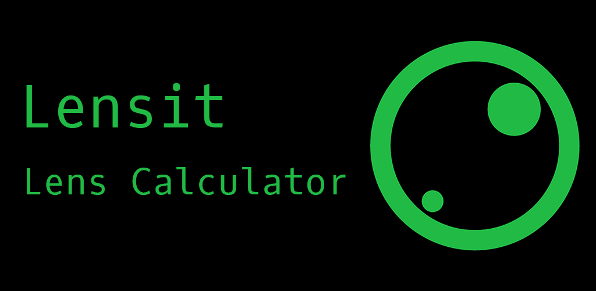

# Lensit

## Tool for calculating lens factors

This project is a tool for calculating lens factors of video projectors. It was build using react as a web tool, as a native windows and mac applications using electron, and as a native app using react-native and expo.

 

